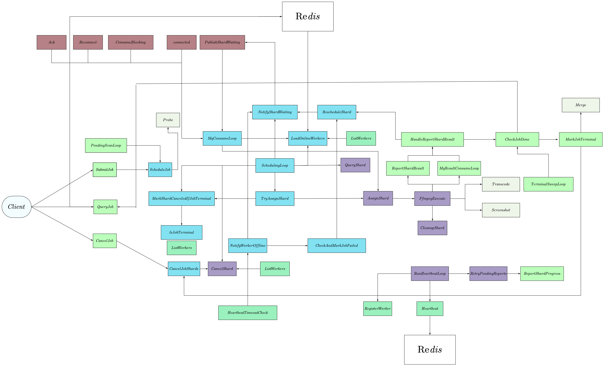

# mprpc-video-platform

从零实现的 Linux C++ 网络库与 RPC 框架，以及构建在两者之上的分布式视频转码平台。三层逐层递进，每一层都是前一层的直接用户：

```
wevix_muduo（网络库） → mprpc（RPC 框架） → video_platform（分布式视频平台）
```

网络库与 RPC 框架完全自研，平台层集成的中间件全部真实可用：ZooKeeper 服务注册发现、MySQL 持久化、Redis 缓存与分布式锁、RabbitMQ 事件驱动调度、FFmpeg 真实转码。整条链路在本地与 Docker 环境均验证通过：提交一段视频，经过时长探测、任务切分、多 Worker 并行转码、结果合并，产出完整成品。

## 项目结构

```
wevix_muduo/        自研网络库：Reactor 模型、线程池、内存池、异步日志
mprpc/              自研 RPC 框架：protobuf 序列化 + ZooKeeper 服务注册发现
video_platform/     分布式视频处理平台：5 个微服务
docker/             Docker 化部署：多阶段构建镜像 + 各服务容器配置
docker-compose.yml  一键编排 4 个中间件 + 5 个平台服务
scripts/            启动、停止、端到端集成测试脚本
doc/                设计文档与开发日志
```

## 一、wevix_muduo：Reactor 网络库

### 整体模型

采用 One Loop Per Thread 模型，受 muduo 启发但完全独立实现：

```
mainLoop_ (Acceptor) ──► 新连接按 fd 取模分配给 subLoops_ ──► subLoops_ × N
                                                                  │
                                                             IO 线程处理 read/write
                                                                  │
                                                   ┌──────────────┴──────────────┐
                                             直接回调处理                   提交到 workThreadPool_
                                             （轻量业务）                 （CPU 密集/阻塞业务）
```

- EventLoop 封装 epoll + eventfd 唤醒 + timerfd 定时，每个 IO 线程跑一个 loop；
- Acceptor 只负责 accept，连接建立后分配给 subLoop，避免单线程成为瓶颈；
- Connection 持有 Socket + Channel + 双 Buffer，读写事件在所属 loop 线程内处理；
- 重活提交到 ThreadPool，IO 线程不做阻塞操作。

### 关键设计

- **连接内状态免锁**：连接从建立到销毁只归属一个 IO 线程，fd、Buffer、回调都在该线程内，连接级状态天然无竞争。
- **Buffer 三区模型 + readv 散射读**：prependable / readable / writable 三区，消费已读数据与前插协议头均为 O(1) 指针移动；readv 一次系统调用读满，空间不足部分才落栈上 64KB 副缓冲。
- **帧编解码下沉**：Connection 可挂 MessageCodec，粘包与半包在连接层循环处理、长度非法直接拒绝，应用层永远收到完整帧；不挂 codec 时行为退回「读到多少给多少」。
- **线程池双模式 + 背压**：IO 线程用固定模式，work 线程用缓存模式按积压自动扩容、空闲 60 秒回收；队列满时投递方等待 1 秒后放弃，把压力传回上游而不是让队列无限膨胀。

## 二、mprpc：RPC 框架

mprpc 基于 wevix_muduo 构建，protobuf 定义接口与序列化，ZooKeeper 做服务注册发现。

### 协议帧格式

自定义二进制帧，客户端在连接层按长度前缀自动拆帧：

```
[total_len(4B, network order)] + [payload]
  payload 请求:   [header_size(4B)] + [RpcHeader(protobuf)] + [args(protobuf)]
  payload 响应:   [response_header_size(4B)] + [RpcResponseHeader(protobuf)] + [response_body]
```

- **两层帧头**：外层长度归网络层 codec 消费，只认帧边界不解析内容；内层 header_size 归应用层消费，定位 RpcHeader 起点。协议演进只需换 codec 实现，互不影响。
- **单帧上限 64MB**：长度非法直接清缓冲拒绝该帧，坏包在协议层被拒，而不是交给 protobuf 解析。
- **拆帧在 IO 线程、业务在 work 线程**：IO 线程只做拆帧与投递，慢业务如最长 15 秒的 ffprobe 探测不会卡死同 loop 上的全部连接。

## 三、video_platform：分布式视频转码平台

把一段视频按时间切成多个 shard，分发给多个 Worker 并行转码，最后合并成完整视频。

### 五个微服务

```
Client/CLI ──SubmitJob──► JobService ──ScheduleJob──► SchedulerService
                                                            │
                                               ListWorkers │  AssignShard
                                                            ▼
                               WorkerManager ◄──────── TranscodeWorker
                                     ▲                        │
                                     │                        │ ReportProgress
                                     └── Heartbeat            │ ReportResult
                                                              ▼
                                                      ResultCollector
```

| 服务 | 职责 | 端口 |
|------|------|------|
| JobService | 任务提交、查询、取消 | 9001 |
| SchedulerService | 时长探测、shard 切分、调度分配、失败重试 | 9002 |
| WorkerManager | Worker 注册、心跳、负载上报 | 9003 |
| TranscodeWorker | FFmpeg 真实转码执行，可横向扩容 | 9004+ |
| ResultCollector | 结果收集、触发合并、判定终态 | 9005 |

完整调用关系图（含各服务内部的主要函数、Redis 与 MQ 的交互）：



### 任务模型与调度

- **Job → Shard → Attempt 三层建模**：Shard 是调度、重试与幂等的最小单元；每次重试递增 attempt_id 标记执行代次，Worker 迟到上报的结果按代次直接丢弃。
- **资源感知评分**：按 score = 空闲槽×10 - CPU×0.5 - 内存×0.2 打分选节点，轮内账本修正静态快照导致的超额分配；重试优先换节点，避免磁盘满、OOM 这类节点本地故障反复命中同一台。
- **优先级队列 + 过载保护**：shard 按 job 优先级降序出队、同优先级 FIFO 防饥饿；Worker 侧对超载硬拒绝，运行数达上限或 CPU 超 90% 即拒收。
- **切分与探测**：ffprobe 探测真实时长后向上取整切分、末片时长自适应，探测失败回退配置值并带 15 秒超时保护。
- **结果与进度上报**：结果上报走 MQ → 直连 RPC 重试 → 本地队列每 3 秒兜底三级降级；进度存 Worker 本地由调度器按需拉取，避免大量 shard 并发推送产生的无效 RPC。

### 故障恢复

五类故障统一收敛到「shard 重置为 WAITING 重新调度」，全部恢复路径复用同一套分配逻辑：

| 故障 | 检测 | 恢复 |
|------|------|------|
| 执行失败 | 结果上报失败 | 重试，优先换节点 |
| Worker 退出 | 心跳超时 20 秒 | 该节点未完成 shard 重置排队 |
| 执行卡死 | 5 分钟无更新 + 30 秒重扫 | 取消旧代次，重置排队 |
| 上报失败 | 上报链路全部失败 | 本地队列每 3 秒兜底重试 |
| 调度器重启 | 启动恢复扫描 | 残留 RUNNING 全部重置排队 |

终态任务的残留 shard 一律取消、绝不复活，判断在每次调度入口现查，不依赖上游通知；单条查询仅 0.2ms，成本低到可以每个入口都查一遍。

### 一致性与幂等

- **状态推进走条件更新**：所有状态变更都是单条 UPDATE ... WHERE status IN (前置状态)，利用 MySQL 行级原子性做 CAS，旧快照写不进去。
- **重复执行三层防护**：分配前的分布式锁防同时重复分配，数据库条件更新兜底，attempt_id 执行代次让旧结果自动失效；即使前两层失效，最终生效的结果也只有一个。
- **取消链路**：状态层用 CAS 强保证取消后不再调度、不再重试、不再合并；执行层尽力而为地通知并杀掉子进程。

### 中间件与降级

- **MySQL 持久化**：三个 Store 以 MySQL 为唯一数据源，服务重启数据不丢、多进程天然共享；连接池固定大小预创建并保活，单条状态操作平均 0.2ms。
- **Redis 缓存与锁**：Worker 心跳双写负载快照，调度器优先读快照、失败回退 RPC 查询，按次降级、恢复自动切回；分配前用 SET NX EX 抢分布式锁防重复分配，Redis 故障时降级放行，正确性由数据库 CAS 兜底。
- **RabbitMQ 事件驱动**：shard 分配由轮询改为事件驱动，调度延迟从平均约 1 秒降至实测 33ms；发布与消费分连接分锁，消费阻塞不卡发布；MQ 掉线自动降级为轮询，恢复后自动切回，轮询同时兜底超时重扫与崩溃恢复。
- **降级语义分层**：MySQL 与 ffmpeg 属于 fail-fast，启动必检、缺失拒绝服务；Redis 与 MQ 属于可降级组件，连不上只告警并走替代路径，不影响主流程。

## 快速开始

完整步骤见 [快速启动指南.md](快速启动指南.md)，这里给最简路径。

**方式一：手工部署**。编译依赖 protobuf、ZooKeeper C 库、hiredis、rabbitmq-c、ffmpeg；运行还需本机启动 ZooKeeper、MySQL、Redis、RabbitMQ：

```bash
# 构建
cmake -B build -DCMAKE_BUILD_TYPE=Release
cmake --build build -j$(nproc)

# 启动 5 个服务（配置文件在 video_platform/conf/）
./bin/job_service       -i video_platform/conf/job_service.conf &
./bin/scheduler_service -i video_platform/conf/scheduler.conf &
./bin/worker_manager    -i video_platform/conf/worker_manager.conf &
./bin/result_collector  -i video_platform/conf/result_collector.conf &
./bin/transcode_worker  -i video_platform/conf/transcode_worker_9004.conf &

# 提交任务（管道输入：user → input → output → format → resolution → bitrate → priority → shard_duration）
printf 'test_user\n/tmp/test_video.mp4\n/tmp/output\nmp4\n720p\n2000\n0\n15\n' \
    | ./bin/job_client -i video_platform/conf/job_client.conf

# 轮询结果
./bin/job_client -i video_platform/conf/job_client.conf --query <job_id> --watch
```

**方式二：Docker 一键启动**，9 个容器：4 中间件 + 5 服务：

```bash
docker compose up -d --build
docker compose exec job_service sh -c \
  'printf "%s\n" "test_user" "/data/videos/sample.mp4" "/data/output" "mp4" "720p" "0" "0" "0" \
   | ./bin/job_client -i /app/conf/job_client.conf'
```

视频放 data/videos/，合并产物在 data/output/{job_id}_merged.mp4。扩容 Worker：`docker compose up -d --scale transcode_worker=3`，worker_id 取容器 hostname 天然唯一，无需改配置。
